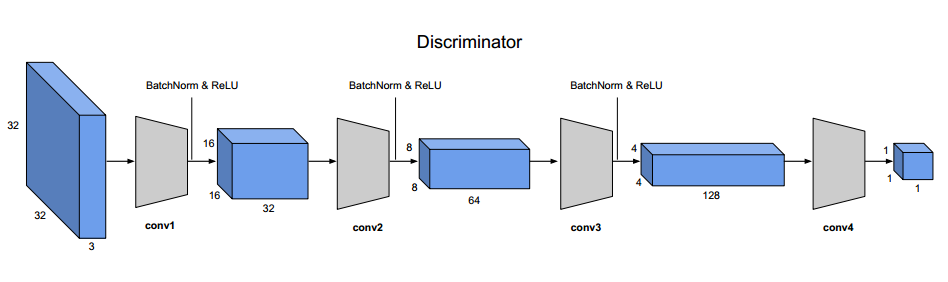
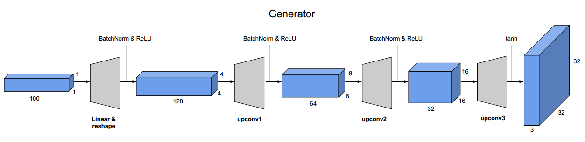
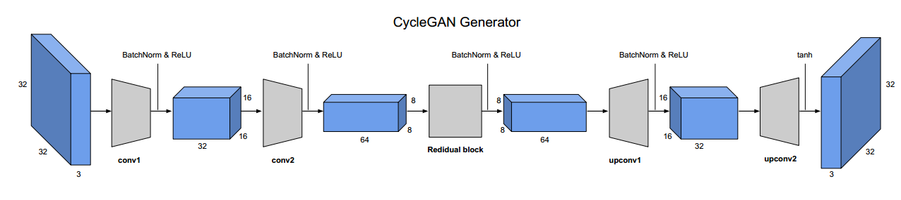
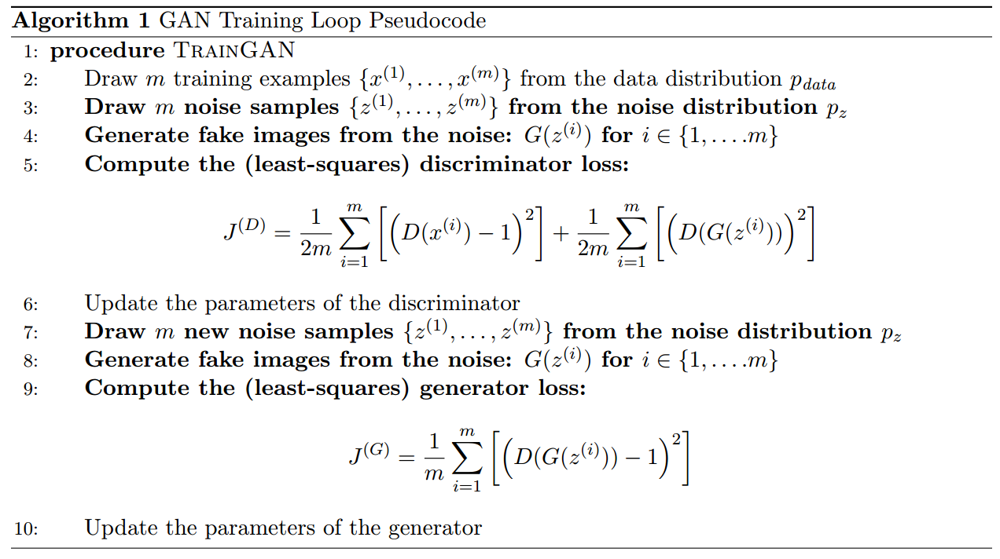
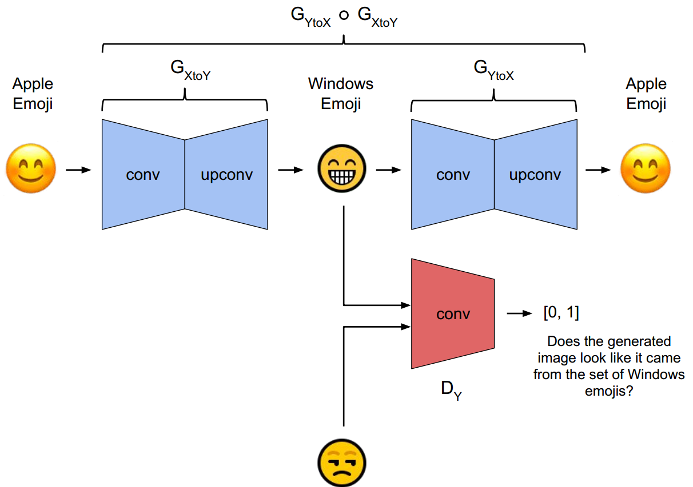
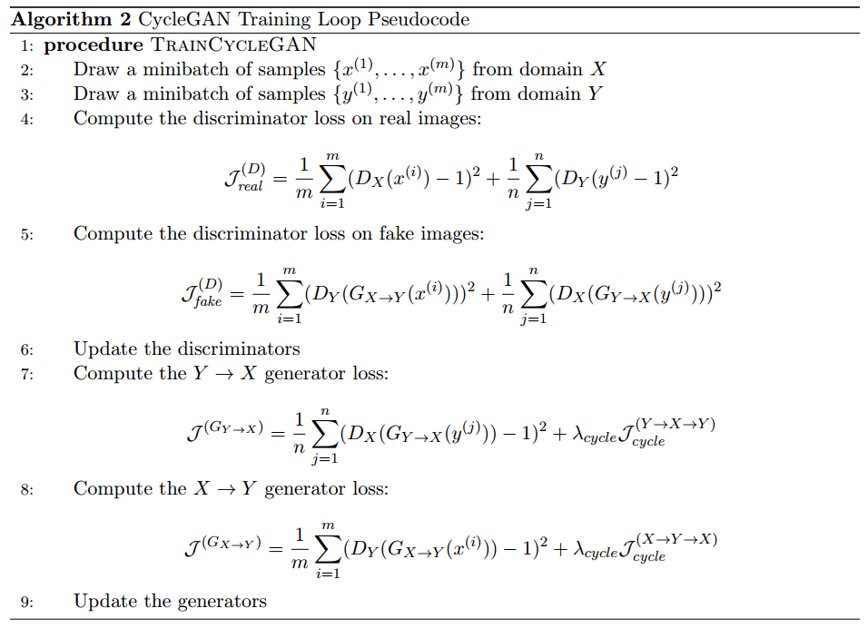

# The model architecture and training procedures

Discriminator of both two models

Generator of VanillaGAN

Generator of CycleGAN

TrainingProcedure of VanillaGAN

Architecture of CycleGAN

TrainingProcedure of CycleGAN

